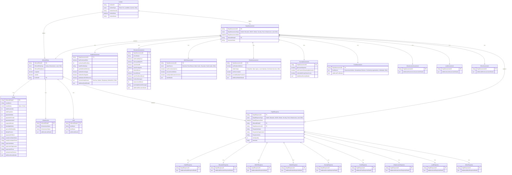

```mermaid
erDiagram
    Incident {
        string IncidentID "PK"
        enum IncidentType "Flood, Fire, Landslide, Cyclone, Other"
        string IncidentSeverity
        datetime IncidentDate
        string IncidentName
    }

    AffectedEntity {
        string AffectedEntityID "PK"
        enum AffectedEntityType "Camp, Infrastructure, Land, Other"
        string AffectedEntityName
        decimal Longitude
        decimal Latitude
        string IncidentID "FK"
    }

    Camp {
        string AffectedEntityID "PK"
        string campName
        enum campStatus "Open, Closed"
        int totalHouseholds
        int totalPopulation
        int populationMale
        int populationFemale
        int populationUnder5
        int pregnantWomen
        int lactatingMothers
        int personWithDisability
        int elderlyPersons
        int separatedChildren
        string campCoordinatorName
        string campCoordinatorPhone
        string superviserName
        string superviserOrganization
        string superviserPhone
        int numberActivePartners
        json additionalCampDetails
    }

    Infrastructure {
        string AffectedEntityID "PK"
        string infrastructureName
        string infrastructureStatus
        json additionalLandDetails
    }

    Land {
        string AffectedEntityID "PK"
        string landName
        string landStatus
        json additionalDetails
    }

    RapidAssessment {
        string RapidAssessmentID "PK"
        enum RapidAssessmentType "Health, Education, WASH, Shelter, Security, Food, Infrastructure, Land, Other"
        datetime RapidAssessmentDate
        string AffectedEntityID "FK"
        string AssessorName
    }

    HealthAssessment {
        string RapidAssessmentID "PK"
        boolean hasFunctionalClinic
        int numberHealthFacilities
        string healthFacilityType
        int qualifiedHealthWorkers
        boolean hasMedicineSupply
        boolean hasMedicalSupplies
        boolean hasMaternalChildServices
        set commonHealthIssues "Diarrhea, Malaria, Respiratory, Malnutrition, Other"
        json additionalHealthDetails
    }

    EducationAssessment {
        string RapidAssessmentID "PK"
        string schoolName
        boolean isAffectedByFlood
        boolean isOccupiedByIDPs
        boolean needsSandfill
        boolean needsFumigation
        int toiletsAffected
        boolean fenceAffected
        boolean washFacilitiesAffected
        boolean furnitureDamaged
        int classroomsAffected
        string teachingMaterialsDamaged
        json additionalEducationDetails
    }

    WASHAssessment {
        string RapidAssessmentID "PK"
        enum waterSource "Borehole, River/Stream, Water trucks, Tap water, Sachet water, Other"
        boolean hasFunctionalLatrines
        boolean areLatrinesSufficient
        boolean hasOpenDefecationConcerns
        json washDetails
    }

    ShelterAssessment {
        string RapidAssessmentID "PK"
        boolean areSheltersSufficient
        set shelterTypes "Trampoline, Open space, Local materials, Communal structure, Other"
        boolean areOvercrowded
        boolean provideWeatherProtection
        json additionalShelterDetails
    }

    SecurityAssessment {
        string RapidAssessmentID "PK"
        boolean gbvCasesReported
        boolean hasProtectionReportingMechanism
        boolean vulnerableGroupsHaveAccess
        json AadditionalSecurityDetails
    }

    FoodAssessment {
        string RapidAssessmentID "PK"
        set foodSource "Government kitchen, Humanitarian Partners, Community organizations, Individuals, Other"
        json additionalFoodDetails
    }

    InfrastructureAssessment {
        string RapidAssessmentID "PK"
        json additionalInfrastructureAssessmentDetails
    }

    LandAssessment {
        string RapidAssessmentID "PK"
        json additionalLandAssessmentDetails
    }

    OtherAssessment {
        string RapidAssessmentID "PK"
        json additionalOtherAssessmentDetails
    }

    RapidResponse {
        string RapidResponseID "PK"
        enum RapidResponseType "Health, Education, WASH, Shelter, Security, Food, Infrastructure, Land, Other"
        datetime RapidResponseDate
        string AffectedEntityID "FK"
        string RapidAssessmentID "FK"
        string ResponderName
        string ResponderOrganization
        string ResponseItems
        int ItemQuantity
        string ItemUnits
    }

    HealthResponse {
        string RapidResponseID "PK"
        json additionalHealthResponseDetails
    }

    EducationResponse {
        string RapidResponseID "PK"
        json additionalEducationResponseDetails
    }

    WASHResponse {
        string RapidResponseID "PK"
        json additionalWashResponseDetails
    }

    ShelterResponse {
        string RapidResponseID "PK"
        json additionalShelterResponseDetails
    }

    SecurityResponse {
        string RapidResponseID "PK"
        json additionalSecurityResponseDetails
    }

    FoodResponse {
        string RapidResponseID "PK"
        json additionalFoodResponseDetails
    }

    InfrastructureResponse {
        string RapidResponseID "PK"
        json additionalInfrastructureResponseDetails
    }

    LandResponse {
        string RapidResponseID "PK"
        json additionalLandResponseDetails
    }

    OtherResponse {
        string RapidResponseID "PK"
        json additionalOtherResponseDetails
    }

    Incident ||--|{ AffectedEntity : "affects"
    Incident ||--|{ RapidAssessment : "triggers"
    RapidAssessment }|--|| AffectedEntity : "assesses"
    AffectedEntity ||--|{ RapidResponse : "receives"
    RapidAssessment ||--|{ RapidResponse : "leads to"

    AffectedEntity ||--|| Camp : "is-a"
    AffectedEntity ||--|| Infrastructure : "is-a"
    AffectedEntity ||--|| Land : "is-a"

    RapidAssessment ||--|| HealthAssessment : "is-a"
    RapidAssessment ||--|| EducationAssessment : "is-a"
    RapidAssessment ||--|| WASHAssessment : "is-a"
    RapidAssessment ||--|| ShelterAssessment : "is-a"
    RapidAssessment ||--|| SecurityAssessment : "is-a"
    RapidAssessment ||--|| FoodAssessment : "is-a"
    RapidAssessment ||--|| InfrastructureAssessment : "is-a"
    RapidAssessment ||--|| LandAssessment : "is-a"
    RapidAssessment ||--|| OtherAssessment : "is-a"

    RapidResponse ||--|| HealthResponse : "is-a"
    RapidResponse ||--|| EducationResponse : "is-a"
    RapidResponse ||--|| WASHResponse : "is-a"
    RapidResponse ||--|| ShelterResponse : "is-a"
    RapidResponse ||--|| SecurityResponse : "is-a"
    RapidResponse ||--|| FoodResponse : "is-a"
    RapidResponse ||--|| InfrastructureResponse : "is-a"
    RapidResponse ||--|| LandResponse : "is-a"
    RapidResponse ||--|| OtherResponse : "is-a"
    
```