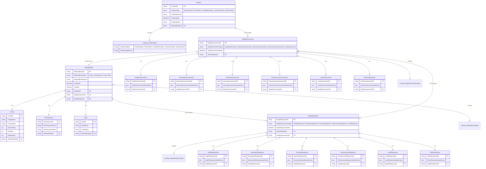

```mermaid
erDiagram
    Incident {
        string IncidentID "PK"
        enum IncidentType "FloodIncident, FireIncident, LandslideIncident, CycloneIncident, OtherIncident"
        string IncidentSeverity
        datetime IncidentDate
        string IncidentName
        string AffectedEntityID "FK"
    }

    Lookup_IncidentType {
        string IncidentTypeID "FloodIncident, FireIncident, LandslideIncident, CycloneIncident, OtherIncident"
        string IncidentTypeName
    }

    AffectedEntity {
        string AffectedEntityID "PK"
        enum AffectedEntityType "Camp, Infrastructure, Land, Other"
        string AffectedEntityName
        decimal Longitude
        decimal Latitude
        string IncidentID "FK"
        string RapidAssessment "FK"
        string RapidResponse "FK"
    }

    Camp {
        string CampID "PK"
        string CampName
        string CampStatus
        int PopChildren
        int PopMen
        int PopWomen
        string AffectedEntityID "FK"
    }

    Infrastructure {
        string InfrastructureID "PK"
        string InfrastructureName
        string InfrastructureStatus
        string AffectedEntityID "FK"
    }

    Land {
        string LandID "PK"
        string LandName
        string LandStatus
        string AffectedEntityID "FK"
    }

    RapidAssessment {
        string RapidAssessmentID "PK"
        enum RapidAssessmentType "HealthAssessment, EducationAssessment, SecurityAssessment, InfrastructureAssessment, LandAssessment"
        datetime RapidAssessmentDate
        string AffectedEntityID "FK"
    }

    HealthAssessment {
        string HealthAssessmentID "PK"
        json HealthAssessmentDataPoints
        string RapidAssessmentID "FK"
    }

    EducationAssessment {
        string EducationAssessmentID "PK"
        json EducationAssessmentDataPoints
        string RapidAssessmentID "FK"
    }

    SecurityAssessment {
        string SecurityAssessmentID "PK"
        json SecurityAssessmentDataPoints
        string RapidAssessmentID "FK"
    }

    InfrastructureAssessment {
        string InfrastructureAssessmentID "PK"
        json InfrastructureAssessmentDataPoints
        string RapidAssessmentID "FK"
    }

    LandAssessment {
        string LandAssessmentID "PK"
        json LandAssessmentDataPoints
        string RapidAssessmentID "FK"
    }

    OtherAssessment {
        string OtherAssessmentID "PK"
        json OtherAssessmentDataPoints
        string RapidAssessmentID "FK"
    }

    RapidResponse {
        string RapidResponseID "PK"
        enum RapidAssessmentType "HealthResponse, EducationResponse, SecurityResponse, InfrastructureResponse, LandResponse"
        datetime RapidResponseDate
        string AffectedEntityID "FK"
        string RapidAssessmentID "FK"
    }

    HealthResponse {
        string HealthResponseID "PK"
        json HealthResponseDataPoints
        string RapidResponseID "FK"
    }

    EducationResponse {
        string EducationResponseID "PK"
        json EducationResponseDataPoints
        string RapidResponseID "FK"
    }

    SecurityResponse {
        string SecurityResponseID "PK"
        json SecurityResponseDataPoints
        string RapidResponseID "FK"
    }

    InfrastructureResponse {
        string InfrastructureResponseID "PK"
        json InfrastructureResponseDataPoints
        string RapidResponseID "FK"
    }

    LandResponse {
        string LandResponseID "PK"
        json LandResponseDataPoints
        string RapidResponseID "FK"
    }

    OtherResponse {
        string OtherResponseID "PK"
        json OtherResponseDataPoints
        string RapidResponseID "FK"
    }

    Incident }|--|| Lookup_IncidentType : "LookUp"
    Incident ||--|{ RapidAssessment : "One-to-Many"
    RapidAssessment }|--|| AffectedEntity : "Many-to-One"
    AffectedEntity ||--|{ RapidResponse : "One-to-Many"
    RapidAssessment ||--|{ RapidResponse : "One-to-Many"

    AffectedEntity }|--|| Lookup_AffectedEntityType : "LookUp"
    AffectedEntity ||--|| Camp : "is-a"
    AffectedEntity ||--|| Infrastructure : "is-a"
    AffectedEntity ||--|| Land : "is-a"

    RapidAssessment }|--|| Lookup_RapidAssessmentType : "LookUp"
    RapidAssessment ||--|| HealthAssessment : "is-a"
    RapidAssessment ||--|| EducationAssessment : "is-a"
    RapidAssessment ||--|| SecurityAssessment : "is-a"
    RapidAssessment ||--|| InfrastructureAssessment : "is-a"
    RapidAssessment ||--|| LandAssessment : "is-a"
    RapidAssessment ||--|| OtherAssessment : "is-a"

    RapidResponse }|--|| Lookup_RapidResponseType : "LookUp"
    RapidResponse ||--|| HealthResponse : "is-a"
    RapidResponse ||--|| EducationResponse : "is-a"
    RapidResponse ||--|| SecurityResponse : "is-a"
    RapidResponse ||--|| InfrastructureResponse : "is-a"
    RapidResponse ||--|| LandResponse : "is-a"
    RapidResponse ||--|| OtherResponse : "is-a"


```
