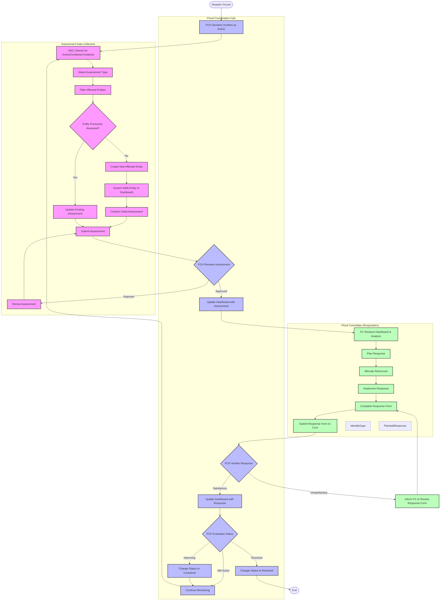

```mermaid

flowchart TD
    %% Main flow
    Start([Disaster Occurs]) --> DeclareIncident
    DeclareIncident[FCH Declares Incident as Active] --> ADCProcess
    
    %% ADC Process
    ADCProcess[ADC Checks for Active/Contained Incidents] --> SelectAssessType
    SelectAssessType[Select Assessment Type] --> FilterEntities
    FilterEntities[Filter Affected Entities] --> CheckEntity
    CheckEntity{Entity Previously Assessed?} --> |Yes| UpdateAssessment
    CheckEntity --> |No| CreateEntity
    CreateEntity[Create New Affected Entity] --> AutoAddDashboard
    AutoAddDashboard[System Adds Entity to Dashboard] --> ConductAssessment
    ConductAssessment[Conduct Initial Assessment] --> SubmitAssessment
    UpdateAssessment[Update Existing Assessment] --> SubmitAssessment
    
    %% FCH Review Process
    SubmitAssessment[Submit Assessment] --> ReviewAssessment
    ReviewAssessment{FCH Reviews Assessment} --> |Approved| UpdateDashAssess
    ReviewAssessment --> |Rejected| ReviseAssessment
    ReviseAssessment[Revise Assessment] --> SubmitAssessment
    UpdateDashAssess[Update Dashboard with Assessment] --> FCMonitors
    
    %% Response Committee Process
    FCMonitors[FC Reviews Dashboard & Analysis] --> PlanResponse
    PlanResponse[Plan Response] --> AllocateResources
    AllocateResources[Allocate Resources] --> ImplementResponse
    ImplementResponse[Implement Response] --> CompleteResponseForm
    CompleteResponseForm[Complete Response Form] --> SubmitRespForm
    
    SubmitRespForm[Submit Response Form to FCH] --> VerifyResponse
    VerifyResponse{FCH Verifies Response} --> |Satisfactory| UpdateDashResp
    VerifyResponse --> |Unsatisfactory| InformFC
    
    %% Feedback loop for unsatisfactory response
    InformFC[Inform FC to Review Response Form] --> CompleteResponseForm
    
    UpdateDashResp[Update Dashboard with Response] --> EvalStatus
    EvalStatus{FCH Evaluates Status} --> |Still Active| ContinueMonitor
    EvalStatus --> |Improving| ChangeToContained
    ChangeToContained[Change Status to Contained] --> ContinueMonitor
    ContinueMonitor[Continue Monitoring] --> ADCProcess
    EvalStatus --> |Resolved| ChangeToResolved
    ChangeToResolved[Change Status to Resolved] --> End([End])
    
    %% Stakeholder swimlanes
    subgraph "Assessment Data Collectors"
        ADCProcess
        SelectAssessType
        FilterEntities
        CheckEntity
        CreateEntity
        AutoAddDashboard
        ConductAssessment
        UpdateAssessment
        SubmitAssessment
        ReviseAssessment
    end
    
    subgraph "Flood Coordination Hub"
        DeclareIncident
        ReviewAssessment
        UpdateDashAssess
        VerifyResponse
        UpdateDashResp
        EvalStatus
        ChangeToContained
        ChangeToResolved
        ContinueMonitor
    end
    
    subgraph "Flood Committee (Responders)"
        FCMonitors
        PlanResponse
        AllocateResources
        ImplementResponse
        CompleteResponseForm
        SubmitRespForm
        IdentifyGaps
        PlanAddResponse
    end
    
    %% Styles
    classDef assessor fill:#f9f,stroke:#333,stroke-width:2px
    classDef coordinator fill:#bbf,stroke:#333,stroke-width:2px
    classDef responder fill:#bfb,stroke:#333,stroke-width:2px
    
    class ADCProcess,SelectAssessType,FilterEntities,CheckEntity,CreateEntity,AutoAddDashboard,ConductAssessment,UpdateAssessment,SubmitAssessment,ReviseAssessment assessor
    class DeclareIncident,ReviewAssessment,UpdateDashAssess,VerifyResponse,UpdateDashResp,EvalStatus,ChangeToContained,ChangeToResolved,ContinueMonitor coordinator
    class FCMonitors,PlanResponse,AllocateResources,ImplementResponse,CompleteResponseForm,SubmitRespForm,InformFC responder

```